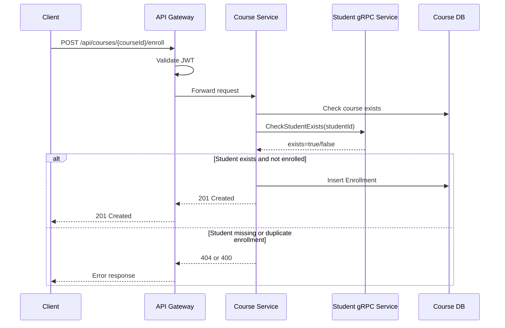

# LMS Lab 3 - Microservices Architecture Report

## 1. Service Decomposition

The LMS system is decomposed into three independent backend services plus one API Gateway. This keeps each business boundary small, deployable, and testable without allowing one service to read another service's database directly.

| Component | Responsibility | Public Protocol |
|---|---|---|
| Identity Service | User registration, login, JWT generation, refresh token lifecycle | REST |
| Student Service | Student profile management and student existence lookup | REST + gRPC Server |
| Course Service | Course, subject, semester, and enrollment management | REST + gRPC Client |
| API Gateway | Single client entry point, JWT validation, routing to downstream services | REST proxy |

Identity is separated because authentication data and refresh tokens have different security and lifecycle requirements from LMS domain data. Student is separated because it owns student identity/profile data. Course is separated because enrollment is course-domain behavior, but it only needs to verify students through Student Service, not own student records.

This design follows Clean Architecture inside each service:

```text
API Layer -> Application Layer -> Domain Interfaces -> Infrastructure
```

Controllers only coordinate HTTP requests and responses. Application services contain business rules, such as duplicate enrollment checks. Repositories contain persistence logic only.

## 2. Database Design

Each service owns its own SQL Server database. Cross-service foreign keys are intentionally avoided. For example, `Enrollment.StudentId` is an integer reference to a student owned by Student Service, but Course DB does not enforce a database foreign key to Student DB.

### Identity DB

| Table | Purpose |
|---|---|
| Users | Stores username, email, BCrypt password hash, role, and creation time |
| RefreshTokens | Stores issued refresh tokens, expiration, and revoke state |

Seed data includes the required grader account:

```text
username: admin
password: 123456
role: Admin
```

The password is stored as a BCrypt hash, never plain text.

### Student DB

| Table | Purpose |
|---|---|
| Students | Stores student profile data: full name, email, student code, date of birth, active state |

The service seeds 50 students to satisfy Lab 1 data requirements. `StudentCode` and `Email` are unique indexes. The student code validator follows FPT-style values such as `SE190001` and `CE190002`.

### Course DB

| Table | Purpose |
|---|---|
| Semesters | Academic semester catalog |
| Subjects | Subject catalog |
| Courses | Course/class records linked to semester and subject |
| Enrollments | Student enrollment records owned by Course Service |

The service seeds 5 semesters, 10 subjects, and 20 courses. Enrollment has a unique index on `(StudentId, CourseId)` to prevent duplicate enrollments.

## 3. API Gateway Configuration

The gateway uses YARP and is the default external entry point at `http://localhost:5000`. It validates JWT tokens before forwarding protected requests.

| Gateway Route | Destination |
|---|---|
| `/api/auth/*`, `/api/v1/auth/*` | Identity Service |
| `/api/students/*`, `/api/v1/students/*`, `/api/v2/students/*` | Student Service |
| `/api/courses/*`, `/api/v1/courses/*` | Course Service |
| `/api/subjects/*`, `/api/v1/subjects/*` | Course Service |
| `/api/semesters/*`, `/api/v1/semesters/*` | Course Service |
| `/api/enrollments/*`, `/api/v1/enrollments/*` | Course Service |

Authentication routes are anonymous so clients can register, login, and refresh tokens. Student and Course routes require the gateway authorization policy. The downstream Student and Course services also validate JWT tokens for defense in depth.

## 4. gRPC Communication Flow

Student Service hosts the gRPC server defined in `protos/student.proto` on port `6001`. Course Service uses a strongly typed gRPC client generated from the same proto contract.

The main Lab 3 business flow is enrollment:



This flow proves service-to-service communication without sharing databases. Course Service owns enrollment behavior, while Student Service remains the source of truth for student existence.

## 5. Deployment

`docker-compose.yml` starts seven containers:

```text
api-gateway
identity-service
student-service
course-service
identity-db
student-db
course-db
```

Each API service has its own Dockerfile. Student Service exposes both REST (`8080`) and gRPC (`6001`). JWT settings and connection strings are provided through environment variables in Docker Compose.

## 6. Demo Checklist

| Test Case | Endpoint | Expected Result |
|---|---|---|
| Login | `POST /api/auth/login` | JWT access token and refresh token |
| Refresh token | `POST /api/auth/refresh-token` | New JWT and refresh token |
| Missing token | `GET /api/students` | `401 Unauthorized` at gateway |
| Protected student list | `GET /api/v1/students?page=1&size=5` | `200 OK` |
| gRPC-backed enrollment | `POST /api/courses/1/enroll` | `201 Created` after Student Service validation |

