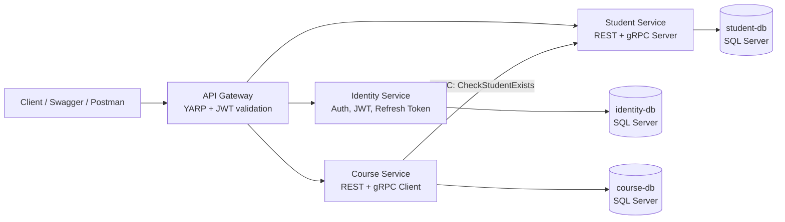
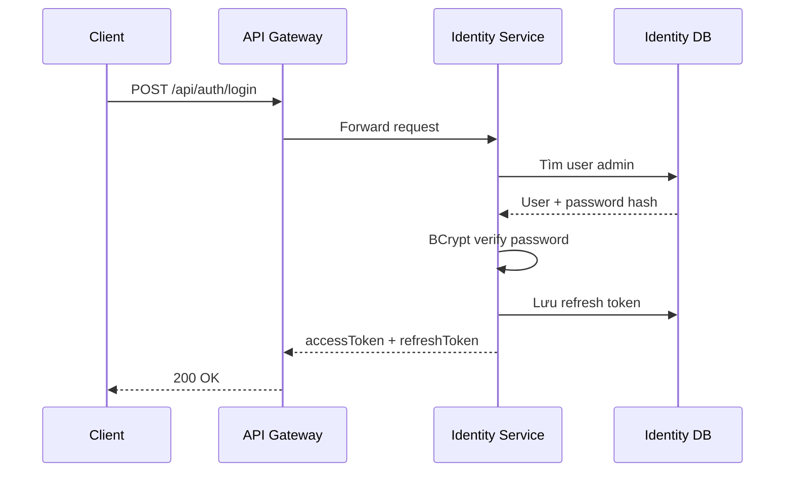
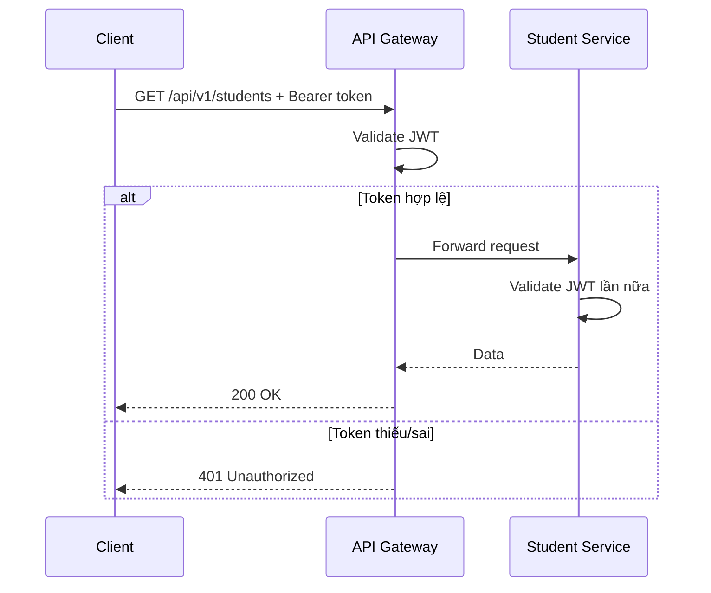
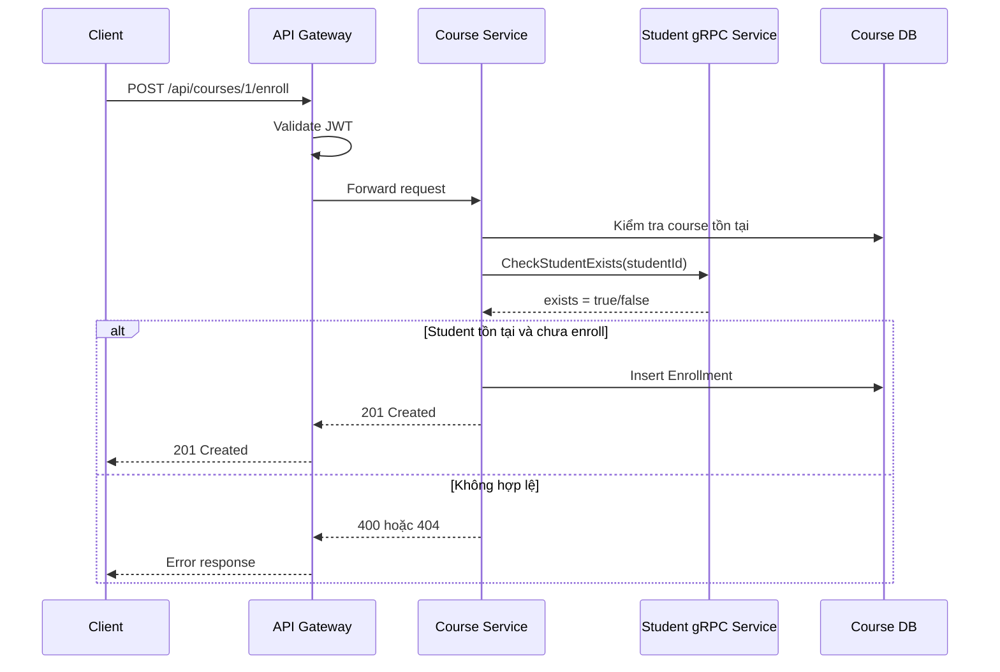

# LMS Lab 3 - gRPC Microservices Architecture


> Một hệ thống Learning Management System được phát triển từ Lab 1 REST API và Lab 2 Security thành kiến trúc Lab 3 Microservices.
> Dự án này không chỉ để nộp bài, mà còn là tài liệu ôn tập về C#, ASP.NET Core, Clean Architecture, JWT, gRPC, API Gateway, EF Core, SQL Server và Docker.

## Mục Lục

- [1. Dự án này giải quyết bài toán gì?](#1-dự-án-này-giải-quyết-bài-toán-gì)
- [2. Chạy nhanh trong 5 phút](#2-chạy-nhanh-trong-5-phút)
- [3. Tài khoản, dữ liệu seed và đường dẫn demo](#3-tài-khoản-dữ-liệu-seed-và-đường-dẫn-demo)
- [4. Kiến trúc tổng quan](#4-kiến-trúc-tổng-quan)
- [5. Ví von thực tế để dễ nhớ](#5-ví-von-thực-tế-để-dễ-nhớ)
- [6. Cấu trúc thư mục](#6-cấu-trúc-thư-mục)
- [7. Các service và trách nhiệm](#7-các-service-và-trách-nhiệm)
- [8. Luồng request quan trọng](#8-luồng-request-quan-trọng)
- [9. Database design và seed data](#9-database-design-và-seed-data)
- [10. API chính cần biết](#10-api-chính-cần-biết)
- [11. Kiến thức C# và .NET học được từ dự án](#11-kiến-thức-c-và-net-học-được-từ-dự-án)
- [12. Architecture và design patterns](#12-architecture-và-design-patterns)
- [13. gRPC trong dự án này](#13-grpc-trong-dự-án-này)
- [14. JWT, Refresh Token và phân quyền](#14-jwt-refresh-token-và-phân-quyền)
- [15. Docker Compose và deployment](#15-docker-compose-và-deployment)
- [16. Swagger: cách demo chuyên nghiệp](#16-swagger-cách-demo-chuyên-nghiệp)
- [17. Checklist Lab 1, Lab 2, Lab 3](#17-checklist-lab-1-lab-2-lab-3)
- [18. Câu hỏi phỏng vấn và cách trả lời](#18-câu-hỏi-phỏng-vấn-và-cách-trả-lời)
- [19. Troubleshooting](#19-troubleshooting)
- [20. Hướng phát triển thêm](#20-hướng-phát-triển-thêm)

## 1. Dự án này giải quyết bài toán gì?

Đây là hệ thống LMS, viết tắt của Learning Management System. Hệ thống quản lý:

- Người dùng và đăng nhập.
- Sinh viên.
- Học kỳ.
- Môn học.
- Khóa học/lớp học.
- Ghi danh sinh viên vào khóa học.

Nếu Lab 1 là một REST API đơn giản, Lab 2 bổ sung security/JWT/validation/middleware, thì Lab 3 nâng cấp thành kiến trúc microservices:

```text
Lab 1: REST API cơ bản
Lab 2: REST API + JWT + validation + middleware + Docker
Lab 3: Microservices + gRPC + API Gateway + database riêng từng service
```

Điểm quan trọng nhất của Lab 3:

> Course Service không được đọc trực tiếp Student DB.
> Khi cần kiểm tra sinh viên tồn tại trước khi ghi danh, Course Service phải gọi Student Service qua gRPC.

Đó là tinh thần thật của microservices: mỗi service sở hữu dữ liệu của mình, giao tiếp qua contract rõ ràng.

## 2. Chạy nhanh trong 5 phút

### Yêu cầu môi trường

- Docker Desktop đang chạy.
- .NET SDK 8.0 nếu muốn build/chạy ngoài Docker.
- Port `5000`, `5001`, `5002`, `5003`, `6001`, `14331`, `14332`, `14333` còn trống.

### Chạy toàn bộ hệ thống

```powershell
docker compose up --build
```

Nếu trước đó đã chạy DB cũ và muốn reset lại seed data:

```powershell
docker compose down -v
docker compose up --build
```

### Build kiểm tra source code

```powershell
dotnet build LMS-Microservices.slnx
```

### Kiểm tra Docker Compose config

```powershell
docker compose config
```

## 3. Tài khoản, dữ liệu seed và đường dẫn demo

### Tài khoản admin seed sẵn

```text
username: admin
password: 123456
role: Admin
```

Mật khẩu không lưu plain text. Identity Service hash mật khẩu bằng BCrypt trước khi lưu database.

### Link demo

| Thành phần | URL |
|---|---|
| API Gateway | `http://localhost:5000` |
| API Gateway Swagger | `http://localhost:5000/swagger` |
| Identity Service Swagger | `http://localhost:5001/swagger` |
| Student Service Swagger | `http://localhost:5002/swagger` |
| Course Service Swagger | `http://localhost:5003/swagger` |
| Student gRPC endpoint | `http://localhost:6001` |

Nên demo chính qua Gateway Swagger:

```text
http://localhost:5000/swagger
```

Vì client thật chỉ nên biết một entry point là API Gateway.

### Demo flow nhanh

1. Mở `http://localhost:5000/swagger`.
2. Gọi `POST /api/auth/login`.
3. Body:

```json
{
  "username": "admin",
  "password": "123456"
}
```

4. Copy `data.accessToken`.
5. Bấm `Authorize`.
6. Dán token.
7. Gọi:

```text
GET /api/v1/students?page=1&size=5
GET /api/v1/courses?page=1&size=10
POST /api/courses/1/enroll
```

Body mẫu cho enroll:

```json
{
  "studentId": 3
}
```

## 4. Kiến trúc tổng quan



Kiến trúc này có 4 application process chính:

- `api-gateway`
- `identity-service`
- `student-service`
- `course-service`

Và 3 database độc lập:

- `identity-db`
- `student-db`
- `course-db`

## 5. Ví von thực tế để dễ nhớ

Hãy tưởng tượng hệ thống này là một trường đại học.

| Thành phần kỹ thuật | Ví von thực tế |
|---|---|
| API Gateway | Quầy lễ tân của trường. Sinh viên/phụ huynh chỉ đi qua một cửa này. |
| Identity Service | Phòng bảo vệ/cấp thẻ. Kiểm tra bạn là ai và có quyền gì. |
| Student Service | Phòng công tác sinh viên. Giữ hồ sơ sinh viên. |
| Course Service | Phòng đào tạo. Quản lý môn học, lớp học và ghi danh. |
| gRPC | Đường dây nội bộ giữa các phòng ban, nhanh và có quy ước rõ ràng. |
| Database per service | Mỗi phòng có tủ hồ sơ riêng, phòng khác không tự ý mở tủ. |
| JWT | Thẻ ra vào. Có thẻ hợp lệ thì được vào khu vực cần đăng nhập. |
| Role Admin | Thẻ quyền cao, được tạo/xóa dữ liệu quản trị. |

Khi ghi danh sinh viên vào lớp:

1. Sinh viên đến quầy lễ tân.
2. Lễ tân kiểm tra thẻ JWT.
3. Phòng đào tạo nhận yêu cầu ghi danh.
4. Phòng đào tạo gọi điện nội bộ sang phòng công tác sinh viên hỏi: "Sinh viên ID 3 có tồn tại không?"
5. Nếu có, phòng đào tạo ghi danh vào sổ của mình.

Đó chính là flow `Course Service -> gRPC -> Student Service`.

## 6. Cấu trúc thư mục

```text
LMS-Lab3-Microservices-
├── Docs/
│   ├── Architecture-Report.md
│   ├── LAB3_gRPC_Microservices_Spec.md
│   ├── PRN232-LAB1-REST-API.md
│   ├── Swagger-Huong-Dan.md
│   └── lab_2_advanced_rest_api_security.md
├── postman/
│   └── LMS-Microservices.postman_collection.json
├── protos/
│   └── student.proto
├── src/
│   ├── ApiGateway/
│   │   └── LMS.ApiGateway/
│   ├── Services/
│   │   ├── Identity/
│   │   │   ├── LMS.Identity.Api/
│   │   │   ├── LMS.Identity.Application/
│   │   │   ├── LMS.Identity.Domain/
│   │   │   └── LMS.Identity.Infrastructure/
│   │   ├── Student/
│   │   │   ├── LMS.Student.Api/
│   │   │   ├── LMS.Student.Application/
│   │   │   ├── LMS.Student.Domain/
│   │   │   ├── LMS.Student.Infrastructure/
│   │   │   └── LMS.Student.Grpc/
│   │   └── Course/
│   │       ├── LMS.Course.Api/
│   │       ├── LMS.Course.Application/
│   │       ├── LMS.Course.Domain/
│   │       ├── LMS.Course.Infrastructure/
│   │       └── LMS.Course.GrpcClient/
│   └── Shared/
│       └── LMS.Shared.Contracts/
├── docker-compose.yml
├── LMS-Microservices.slnx
└── README.md
```

### Cách đọc cấu trúc này

Mỗi service đi theo Clean Architecture:

```text
Api             Nhận HTTP request, Swagger, middleware
Application     DTO, interface service, validator, use case contract
Domain          Entity, repository interface, business type cốt lõi
Infrastructure  EF Core DbContext, repository implementation, service implementation
```

Riêng Student có thêm:

```text
LMS.Student.Grpc
```

Đây là nơi implement gRPC server cho Course Service gọi.

Riêng Course có thêm:

```text
LMS.Course.GrpcClient
```

Đây là nơi implement gRPC client gọi sang Student Service.

## 7. Các service và trách nhiệm

| Service | Trách nhiệm | Database | Giao tiếp |
|---|---|---|---|
| Identity Service | Register, login, JWT, refresh token, logout | `identity-db` | REST |
| Student Service | CRUD sinh viên, cung cấp gRPC check student | `student-db` | REST + gRPC |
| Course Service | Courses, subjects, semesters, enrollments | `course-db` | REST + gRPC client |
| API Gateway | Entry point, route request, validate JWT | Không có DB | YARP reverse proxy |

Nguyên tắc:

- Identity Service không quản lý student profile.
- Student Service không quản lý enrollment.
- Course Service không đọc Student DB.
- Gateway không chứa business logic.

## 8. Luồng request quan trọng

### 8.1 Login và lấy JWT



### 8.2 Gọi API protected



### 8.3 Ghi danh sinh viên bằng gRPC



## 9. Database design và seed data

### 9.1 Identity DB

| Table | Ý nghĩa |
|---|---|
| `Users` | Lưu username, email, password hash, role |
| `RefreshTokens` | Lưu refresh token, thời gian hết hạn, trạng thái revoke |

Seed:

```text
admin / 123456 / Admin
```

### 9.2 Student DB

| Table | Ý nghĩa |
|---|---|
| `Students` | Hồ sơ sinh viên |

Seed:

```text
50 students
```

Các field chính:

- `StudentId`
- `FullName`
- `Email`
- `StudentCode`
- `DateOfBirth`
- `IsActive`

`StudentCode` có định dạng như:

```text
SE190001
CE190002
SA190003
QE190004
```

### 9.3 Course DB

| Table | Ý nghĩa |
|---|---|
| `Semesters` | Học kỳ |
| `Subjects` | Môn học |
| `Courses` | Khóa học/lớp học |
| `Enrollments` | Ghi danh sinh viên vào khóa học |

Seed:

```text
5 semesters
10 subjects
20 courses
```

Enrollment không có foreign key sang Student DB. Lý do:

> Trong microservices, database của service nào service đó sở hữu.
> Course DB chỉ lưu `StudentId` như một reference, còn việc sinh viên có tồn tại hay không phải hỏi Student Service qua gRPC.

## 10. API chính cần biết

### 10.1 Auth APIs

| Method | Endpoint | Quyền | Ý nghĩa |
|---|---|---|---|
| POST | `/api/auth/register` | Anonymous | Đăng ký |
| POST | `/api/auth/login` | Anonymous | Đăng nhập lấy JWT |
| POST | `/api/v1/auth/login` | Anonymous | Login versioned |
| POST | `/api/auth/refresh-token` | Anonymous | Cấp access token mới |
| POST | `/api/auth/logout` | Anonymous | Thu hồi refresh token |

### 10.2 Student APIs

| Method | Endpoint | Quyền | Ý nghĩa |
|---|---|---|---|
| GET | `/api/v1/students?page=1&size=5` | Authenticated | Danh sách sinh viên v1 |
| GET | `/api/v2/students?page=1&size=5` | Authenticated | Danh sách sinh viên v2 |
| GET | `/api/students/{id}` | Authenticated | Chi tiết sinh viên |
| POST | `/api/students` | Admin | Tạo sinh viên |
| PUT | `/api/students/{id}` | Authenticated | Cập nhật sinh viên |
| DELETE | `/api/students/{id}` | Admin | Xóa sinh viên |

### 10.3 Course APIs

| Method | Endpoint | Quyền | Ý nghĩa |
|---|---|---|---|
| GET | `/api/v1/courses?page=1&size=10` | Authenticated | Danh sách khóa học |
| GET | `/api/courses/{id}` | Authenticated | Chi tiết khóa học |
| POST | `/api/courses` | Admin | Tạo khóa học |
| PUT | `/api/courses/{id}` | Admin | Cập nhật khóa học |
| DELETE | `/api/courses/{id}` | Admin | Xóa khóa học |
| POST | `/api/courses/{id}/enroll` | Authenticated | Ghi danh, có gRPC verify student |
| GET | `/api/courses/{id}/enrollments` | Authenticated | Danh sách ghi danh của course |

### 10.4 Catalog APIs

| Method | Endpoint | Quyền | Ý nghĩa |
|---|---|---|---|
| GET | `/api/v1/subjects?page=1&size=5` | Authenticated | Danh sách môn học |
| GET | `/api/v1/semesters?page=1&size=5` | Authenticated | Danh sách học kỳ |

### 10.5 Enrollment API tương thích Lab 2

| Method | Endpoint | Quyền | Ý nghĩa |
|---|---|---|---|
| POST | `/api/v1/enrollments` | Authenticated | Tạo enrollment bằng body chứa `studentId`, `courseId` |

Body:

```json
{
  "studentId": 2,
  "courseId": 1
}
```

## 11. Kiến thức C# và .NET học được từ dự án

### 11.1 Attribute trong C#

Ví dụ:

```csharp
[ApiController]
[Route("api/students")]
[Authorize]
public class StudentsController : ControllerBase
{
}
```

Attribute giống như "nhãn dán" đặt lên class hoặc method để framework hiểu cách xử lý.

Ví von:

> Một phòng trong trường có bảng tên "Phòng đào tạo", "Chỉ nhân viên được vào".
> Attribute cũng vậy: nó nói cho ASP.NET Core biết controller này route ở đâu, cần quyền gì.

Các attribute quan trọng:

| Attribute | Ý nghĩa |
|---|---|
| `[ApiController]` | Bật behavior dành cho Web API |
| `[Route]` | Định nghĩa URL |
| `[HttpGet]`, `[HttpPost]` | Định nghĩa HTTP method |
| `[Authorize]` | Cần đăng nhập |
| `[Authorize(Roles = "Admin")]` | Cần role Admin |
| `[FromBody]` | Bind data từ request body |
| `[FromQuery]` | Bind data từ query string |

### 11.2 DTO

DTO là Data Transfer Object.

Trong dự án:

- Entity dùng cho database.
- DTO dùng để trả dữ liệu ra client.
- Request model dùng để nhận input từ client.

Tại sao không trả Entity trực tiếp?

> Entity là hồ sơ nội bộ trong tủ.
> DTO là bản photo đã che bớt thông tin nhạy cảm để đưa cho người ngoài.

Lợi ích:

- Không lộ field nội bộ.
- API contract ổn định hơn.
- Dễ validate input.
- Dễ format response.

### 11.3 async/await

Ví dụ:

```csharp
public async Task<IActionResult> GetById(int id)
{
    var result = await _studentService.GetByIdAsync(id);
    return Ok(result);
}
```

`async/await` giúp thread không bị chặn khi chờ database hoặc network.

Ví von:

> Bạn gọi món ở quán ăn. Thay vì đứng im ở quầy đợi bếp nấu xong, bạn lấy số bàn rồi làm việc khác.
> Khi món xong, quán gọi bạn. Đó là tinh thần async.

Trong Web API, async giúp server phục vụ nhiều request hơn.

### 11.4 Dependency Injection

Ví dụ:

```csharp
builder.Services.AddScoped<IStudentService, StudentService>();
builder.Services.AddScoped<IStudentRepository, StudentRepository>();
```

Controller không tự `new StudentService()`. Nó yêu cầu interface:

```csharp
public StudentsController(IStudentService studentService)
{
    _studentService = studentService;
}
```

Lợi ích:

- Dễ test.
- Giảm coupling.
- Đổi implementation không phải sửa controller.
- Tuân thủ Dependency Inversion Principle.

Ví von:

> Controller giống quản lý. Quản lý không tự đi mua máy in.
> Quản lý chỉ yêu cầu "tôi cần một máy in", bộ phận hậu cần đưa đúng máy.
> DI container chính là bộ phận hậu cần.

### 11.5 LINQ và EF Core

Repository dùng EF Core để query database.

Ví dụ tư duy:

```csharp
query = query.Where(s => s.FullName.Contains(search));
query = query.Skip((page - 1) * size).Take(size);
```

LINQ giúp viết query bằng C# thay vì SQL string thủ công.

EF Core sẽ chuyển LINQ thành SQL phù hợp với SQL Server.

### 11.6 Generics

Shared response dùng generic:

```csharp
ApiResponse<T>
PagedResult<T>
```

Ý nghĩa:

- `ApiResponse<StudentResponse>`
- `ApiResponse<CourseDTO>`
- `PagedResult<SubjectDTO>`

Một class dùng lại được cho nhiều kiểu dữ liệu.

Ví von:

> Hộp giao hàng có cùng thiết kế, nhưng bên trong có thể là sách, áo, laptop.
> `T` chính là món đồ bên trong hộp.

### 11.7 Middleware pipeline

Trong ASP.NET Core, request đi qua một chuỗi middleware.

Ví dụ:

```csharp
app.UseSwagger();
app.UseAuthentication();
app.UseAuthorization();
app.MapControllers();
```

Thứ tự rất quan trọng.

Ví von:

> Muốn vào văn phòng: qua bảo vệ trước, kiểm tra thẻ, rồi mới vào phòng làm việc.
> Nếu xếp sai thứ tự, có thể vào phòng trước khi kiểm tra thẻ.

## 12. Architecture và design patterns

### 12.1 Clean Architecture

Mục tiêu:

> Business logic không phụ thuộc vào framework, database, HTTP hay Swagger.

Các layer:

```text
API Layer
Application Layer
Domain Layer
Infrastructure Layer
```

Quy tắc phụ thuộc:

```text
API -> Application -> Domain
Infrastructure -> Domain/Application
```

Domain không biết SQL Server là gì.
Application không biết HTTP request cụ thể ra sao.
Controller không chứa business rule.

### 12.2 Repository Pattern

Repository che giấu chi tiết truy cập database.

Controller không gọi DbContext.
Service không viết SQL trực tiếp.

Ví von:

> Bạn cần hồ sơ sinh viên. Bạn không tự vào kho lục từng tủ.
> Bạn nói thủ thư: "Lấy giúp tôi hồ sơ sinh viên ID 3".
> Repository chính là thủ thư.

Lợi ích:

- Tách data access ra khỏi business logic.
- Dễ thay đổi database/query.
- Dễ mock khi test.

### 12.3 Service Layer / Application Service

Application service chứa business rule.

Ví dụ trong enrollment:

1. Course phải tồn tại.
2. Student phải tồn tại qua gRPC.
3. Student chưa được enroll course đó.
4. Nếu hợp lệ mới tạo Enrollment.

Những rule này không nên nằm trong controller hoặc repository.

### 12.4 DTO Pattern

DTO giúp API contract rõ ràng.

```text
Entity      Database mapping
Request     Client input
Response    Client output
DTO         Data trao đổi giữa layer/API
```

### 12.5 API Gateway Pattern

Gateway là cửa duy nhất client gọi vào.

Lợi ích:

- Client không cần nhớ nhiều service URL.
- Validate JWT trước khi forward.
- Che giấu topology bên trong.
- Dễ thêm logging/rate limit/cors sau này.

Trade-off:

- Gateway có thể thành điểm nghẽn nếu thiết kế kém.
- Cần cấu hình route cẩn thận.

### 12.6 Database per Service

Mỗi service có database riêng.

Lợi ích:

- Service độc lập hơn.
- Không bị coupling qua schema.
- Team khác nhau có thể phát triển service riêng.

Trade-off:

- Không join trực tiếp giữa DB.
- Cần giao tiếp qua API/gRPC/message broker.
- Consistency phức tạp hơn.

### 12.7 Defense in Depth

Gateway validate JWT, nhưng Student/Course cũng validate JWT.

Tại sao cần hai lớp?

> Cửa chính có bảo vệ, nhưng từng phòng quan trọng vẫn cần kiểm thẻ.

Nếu ai đó gọi thẳng service, service vẫn tự bảo vệ.

## 13. gRPC trong dự án này

### 13.1 gRPC là gì?

gRPC là cơ chế giao tiếp service-to-service, dùng HTTP/2 và contract `.proto`.

Trong dự án:

```text
Course Service -> Student Service
```

Course hỏi:

```text
Sinh viên ID này có tồn tại không?
```

Student trả:

```text
exists = true/false
```

### 13.2 Proto contract

File:

```text
protos/student.proto
```

Nội dung chính:

```proto
service StudentGrpcService {
  rpc GetStudentById (GetStudentByIdRequest) returns (StudentReply);
  rpc CheckStudentExists (CheckStudentExistsRequest) returns (CheckStudentExistsReply);
}
```

`.proto` giống như hợp đồng giữa hai phòng ban.

> Course và Student không cần biết code nội bộ của nhau.
> Chỉ cần thống nhất "tôi gọi method này, gửi message này, nhận message kia".

### 13.3 Vì sao dùng gRPC thay vì gọi database?

Không dùng:

```text
Course Service -> Student DB
```

Dùng:

```text
Course Service -> Student Service -> Student DB
```

Lý do:

- Student Service là chủ sở hữu Student DB.
- Course Service không nên phụ thuộc schema Student DB.
- Nếu Student DB đổi column/table, Course Service không bị ảnh hưởng miễn gRPC contract giữ nguyên.

### 13.4 Khi nào nên dùng gRPC?

Nên dùng khi:

- Service-to-service nội bộ.
- Cần performance tốt.
- Contract rõ ràng.
- Data dạng strongly typed.

Không nhất thiết dùng khi:

- Public API cho browser/client đơn giản.
- Cần debug thủ công thật dễ bằng URL.
- Client không hỗ trợ gRPC tốt.

## 14. JWT, Refresh Token và phân quyền

### 14.1 JWT là gì?

JWT là token chứa thông tin định danh người dùng.

Trong dự án token có:

- `sub`: user id.
- `email`.
- `role`.
- `exp`: thời gian hết hạn.

Client gửi token bằng header:

```http
Authorization: Bearer {accessToken}
```

### 14.2 Access token và refresh token

| Token | Sống bao lâu | Dùng để làm gì |
|---|---:|---|
| Access token | Ngắn | Gọi API |
| Refresh token | Dài hơn | Xin access token mới |

Ví von:

> Access token là vé vào cửa trong ngày.
> Refresh token là thẻ thành viên dùng để lấy vé mới khi vé cũ hết hạn.

### 14.3 401 và 403 khác nhau thế nào?

| Status | Ý nghĩa | Ví dụ |
|---|---|---|
| 401 Unauthorized | Chưa đăng nhập/token sai | Không gửi Bearer token |
| 403 Forbidden | Đã đăng nhập nhưng không đủ quyền | User role Student gọi API Admin |

Nói khi phỏng vấn:

> 401 là "tôi chưa biết bạn là ai".
> 403 là "tôi biết bạn là ai, nhưng bạn không có quyền làm việc này".

## 15. Docker Compose và deployment

### 15.1 Các container

```text
api-gateway
identity-service
student-service
course-service
identity-db
student-db
course-db
```

### 15.2 Port mapping

| Container | Internal port | Host port |
|---|---:|---:|
| API Gateway | 8080 | 5000 |
| Identity Service | 8080 | 5001 |
| Student REST | 8080 | 5002 |
| Student gRPC | 6001 | 6001 |
| Course Service | 8080 | 5003 |
| Identity SQL Server | 1433 | 14331 |
| Student SQL Server | 1433 | 14332 |
| Course SQL Server | 1433 | 14333 |

### 15.3 Dockerfile multi-stage build

Các service dùng multi-stage Dockerfile:

```text
base    runtime image
build   sdk image để restore/build/publish
final   copy publish output và chạy app
```

Lợi ích:

- Image cuối nhẹ hơn.
- Không mang SDK vào production image.
- Build rõ ràng, dễ cache.

### 15.4 .dockerignore

File `.dockerignore` giúp Docker không gửi file rác vào build context:

- `.git/`
- `.vs/`
- `bin/`
- `obj/`
- logs/cache/test output
- local DB files
- docs/postman không cần trong image

Nếu không có `.dockerignore`, Docker build có thể chậm vì phải gửi nhiều file không cần thiết.

## 16. Swagger: cách demo chuyên nghiệp

### 16.1 Gateway Swagger

Mở:

```text
http://localhost:5000/swagger
```

Gateway Swagger mô tả các route proxy quan trọng.

### 16.2 Service Swagger

| Service | Swagger |
|---|---|
| Identity | `http://localhost:5001/swagger` |
| Student | `http://localhost:5002/swagger` |
| Course | `http://localhost:5003/swagger` |

Mỗi endpoint trong Swagger có ghi chú tiếng Việt bằng `summary` và `remarks`, ví dụ:

- Login dùng tài khoản seed nào.
- API nào cần JWT.
- API nào cần role Admin.
- Enroll gọi gRPC sang Student Service.
- Route nào phục vụ checklist Lab 2.

### 16.3 Thứ tự demo khuyến nghị

1. Mở Gateway Swagger.
2. Login.
3. Authorize bằng access token.
4. Gọi `GET /api/v1/students`.
5. Gọi `GET /api/v1/courses`.
6. Gọi `POST /api/courses/1/enroll`.
7. Gọi `GET /api/courses/1/enrollments`.

## 17. Checklist Lab 1, Lab 2, Lab 3

### Lab 1

| Yêu cầu | Trạng thái |
|---|---|
| RESTful API | Có |
| 3-layer/Clean Architecture | Có |
| DTO không trả Entity trực tiếp | Có |
| Paging/search/sort | Có ở Student, paging ở Course/Catalog |
| Swagger | Có |
| Docker | Có |
| Seed data | Có |

### Lab 2

| Yêu cầu | Trạng thái |
|---|---|
| JWT authentication | Có |
| Role-based authorization | Có |
| Refresh token | Có |
| Password hashing | BCrypt |
| Global exception middleware | Có |
| FluentValidation | Có |
| API versioning | Có |
| Swagger Authorize button | Có |
| Endpoint `/api/auth/login` | Có |
| Endpoint `/api/v1/auth/login` | Có |
| Endpoint `/api/v1/enrollments` | Có |

### Lab 3

| Yêu cầu | Trạng thái |
|---|---|
| Identity Service | Có |
| Student Service | Có |
| Course Service | Có |
| API Gateway YARP | Có |
| Database riêng từng service | Có |
| Student gRPC Server | Có |
| Course gRPC Client | Có |
| Enroll verify Student qua gRPC | Có |
| Docker Compose đủ service + DB | Có |
| Postman Collection | Có |
| Architecture Report | Có |

## 18. Câu hỏi phỏng vấn và cách trả lời

### 18.1 Vì sao tách microservices?

Trả lời ngắn:

> Vì mỗi domain có trách nhiệm và dữ liệu riêng. Identity quản lý xác thực, Student quản lý hồ sơ sinh viên, Course quản lý khóa học và ghi danh. Tách ra giúp service độc lập hơn, dễ scale và dễ thay đổi hơn.

Trả lời sâu:

> Microservices phù hợp khi domain đủ lớn và có boundary rõ. Trong dự án này, Identity, Student, Course là ba bounded context khác nhau. Mỗi service có database riêng để tránh coupling qua schema. Giao tiếp giữa Course và Student dùng gRPC thay vì query chung database.

### 18.2 Vì sao cần API Gateway?

> Gateway là entry point duy nhất cho client. Nó route request đến service phù hợp và validate JWT trước khi forward. Client không cần biết nhiều host/port nội bộ.

Ví dụ:

```text
Client chỉ gọi localhost:5000
Gateway tự chuyển đến identity-service, student-service hoặc course-service
```

### 18.3 Vì sao Course Service không query Student DB?

> Vì Student DB thuộc quyền sở hữu của Student Service. Nếu Course query thẳng Student DB thì hai service bị coupling qua schema database. Khi Student DB đổi schema, Course có thể hỏng. Gọi gRPC giúp phụ thuộc vào contract thay vì phụ thuộc vào database.

### 18.4 Repository Pattern để làm gì?

> Repository đóng gói logic truy cập dữ liệu. Service chỉ gọi interface repository, không quan tâm EF Core query cụ thể. Điều này giúp tách business logic khỏi persistence logic.

### 18.5 Service Layer để làm gì?

> Service Layer chứa business rule. Ví dụ khi enroll: kiểm tra course tồn tại, gọi gRPC check student, kiểm tra duplicate enrollment, rồi mới lưu DB. Controller chỉ nhận request và trả response.

### 18.6 JWT hoạt động thế nào?

> User login thành công thì Identity Service tạo JWT có claim user id, email, role, expiration. Client gửi JWT trong Authorization header. Gateway và downstream services validate issuer, audience, lifetime và signing key.

### 18.7 Refresh token để làm gì?

> Access token nên sống ngắn để giảm rủi ro. Refresh token sống dài hơn và dùng để xin access token mới. Refresh token được lưu DB để có thể revoke khi logout hoặc khi phát hiện rủi ro.

### 18.8 gRPC khác REST thế nào?

| Tiêu chí | REST | gRPC |
|---|---|---|
| Format phổ biến | JSON | Protobuf |
| Transport | HTTP/1.1 hoặc HTTP/2 | HTTP/2 |
| Contract | Thường qua OpenAPI | `.proto` |
| Dễ test bằng browser | Cao | Thấp hơn |
| Service-to-service performance | Tốt | Rất tốt |

Trong dự án:

> REST dùng cho client gọi API.
> gRPC dùng cho Course Service gọi Student Service nội bộ.

### 18.9 Nếu Student Service down khi enroll thì sao?

Hiện tại Course Service sẽ lỗi khi gRPC call thất bại.

Nếu nâng cấp production:

- Thêm retry bằng Polly.
- Thêm circuit breaker.
- Thêm timeout rõ ràng.
- Có thể cache kết quả check student trong thời gian ngắn.
- Có thể dùng message broker cho flow async.

### 18.10 Vì sao vẫn validate JWT ở service khi Gateway đã validate?

> Đây là defense in depth. Gateway là lớp bảo vệ đầu tiên, nhưng downstream service vẫn tự bảo vệ nếu có request đi vòng qua Gateway.

## 19. Troubleshooting

### 19.1 `http://localhost:5000/swagger` không mở được

Chạy lại build image:

```powershell
docker compose up --build
```

Kiểm tra container gateway:

```powershell
docker compose logs api-gateway
```

### 19.2 Login trả 401

Kiểm tra dùng đúng tài khoản:

```text
admin / 123456
```

Nếu DB volume cũ không có seed:

```powershell
docker compose down -v
docker compose up --build
```

### 19.3 API protected trả 401

Nguyên nhân thường gặp:

- Chưa bấm Authorize trên Swagger.
- Dán sai token.
- Token hết hạn.
- Gửi thiếu prefix Bearer nếu test bằng Postman thủ công.

### 19.4 API admin trả 403

Bạn đã đăng nhập, nhưng role không phải Admin.

Dùng tài khoản:

```text
admin / 123456
```

### 19.5 Enrollment trả 404 Student not found

Chọn `studentId` tồn tại trong seed data, ví dụ:

```json
{
  "studentId": 3
}
```

### 19.6 Enrollment trả duplicate

Sinh viên đã ghi danh vào course đó.

Đổi `studentId` hoặc `courseId`.

### 19.7 Docker báo SQL Server chưa sẵn sàng

Các service có retry khi init database, nhưng SQL Server container có thể khởi động chậm.

Xem log:

```powershell
docker compose logs identity-db
docker compose logs student-db
docker compose logs course-db
```

## 20. Hướng phát triển thêm

Nếu muốn nâng cấp dự án theo hướng production hơn:

| Tính năng | Ý nghĩa |
|---|---|
| RabbitMQ | Publish event `StudentEnrolled` khi ghi danh thành công |
| Redis Cache | Cache kết quả `CheckStudentExists` ở Course Service |
| Polly | Retry, timeout, circuit breaker cho gRPC client |
| OpenTelemetry | Trace request xuyên Gateway -> Course -> Student gRPC |
| Health Checks | Kiểm tra trạng thái service và database |
| Centralized Logging | Gom log về Seq/ELK/Grafana Loki |
| Integration Tests | Test flow login, protected API, enrollment |
| CI/CD | Build/test Docker image tự động |

## Ghi nhớ ngắn gọn

Nếu chỉ được nói 5 câu về dự án này trong phỏng vấn:

1. Đây là LMS microservices viết bằng ASP.NET Core 8, gồm Identity, Student, Course và API Gateway.
2. Mỗi service có database SQL Server riêng để giữ boundary độc lập.
3. Gateway dùng YARP để route request và validate JWT trước khi forward.
4. Course Service ghi danh sinh viên bằng cách gọi gRPC sang Student Service, không query Student DB trực tiếp.
5. Dự án áp dụng Clean Architecture, DI, Repository Pattern, DTO, FluentValidation, global exception middleware, Swagger và Docker Compose.

